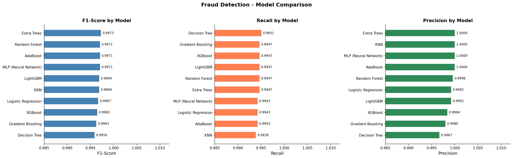
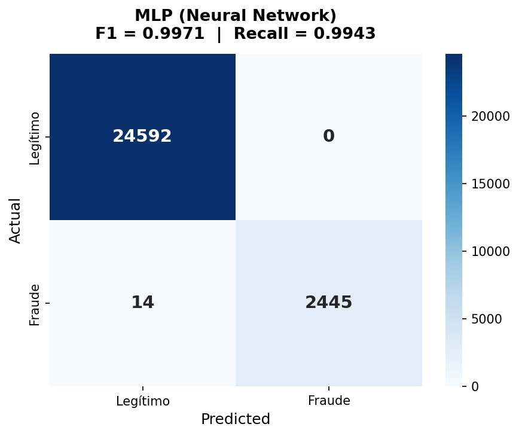
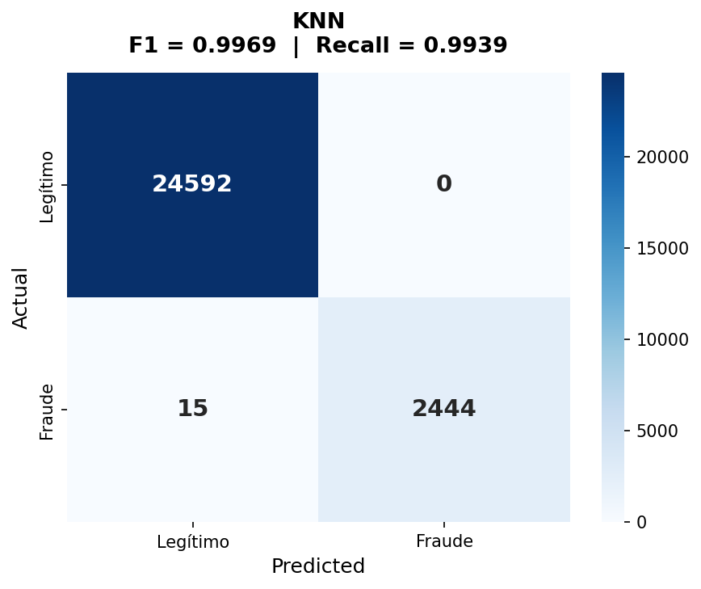
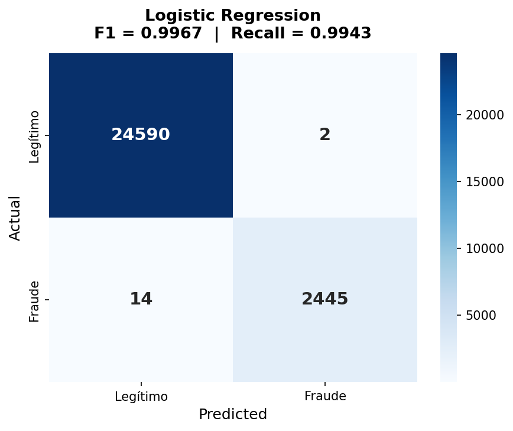
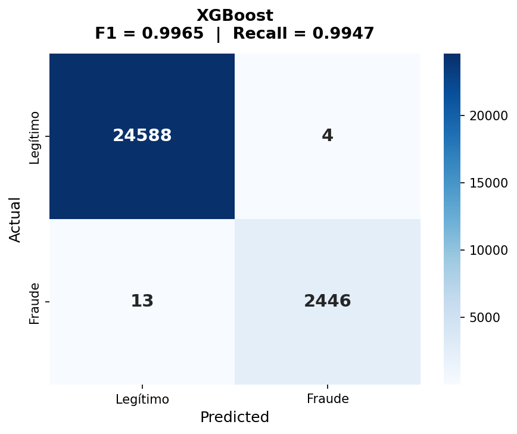
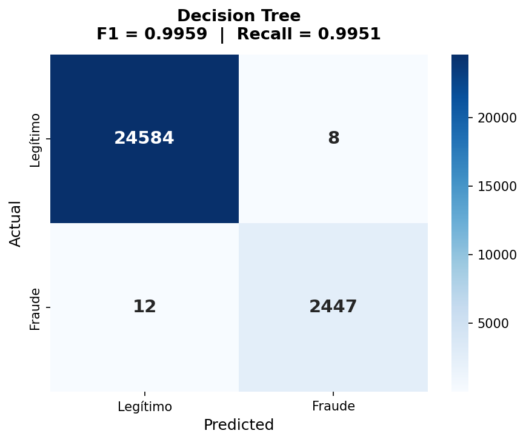

# Fraud Detection — Model Comparison Report

> **Dataset:** `transactions_engineered.csv`
> **Total rows:** 2,770,393 | **Fraud cases:** 8,197 (0.2959%)
> **Sampling strategy:** All 8,197 fraud rows + 10× undersampled non-fraud → 90,167 rows
> **Train / Test split:** 70% / 30% stratified by `isFraud`
> **Train set:** 63,116 rows | **Test set:** 27,051 rows (2,459 fraud / 24,592 legit)
> **Metric priority:** Recall › F1-Score › AUC-ROC › Precision

---

## 1. Why These Metrics?

In tax fraud detection, a **False Negative** (missed fraud) directly translates to lost public revenue and unpunished evasion. A **False Positive** (legitimate transaction flagged) wastes investigator time but causes no lasting harm. Therefore:

| Priority | Metric | Rationale |
|:--------:|--------|-----------|
| 1 | **Recall** | Maximise caught fraud — every FN is a fraud that escapes |
| 2 | **F1-Score** | Harmonic mean; balances Recall against Precision |
| 3 | **AUC-ROC** | Threshold-independent discriminative power |
| 4 | **Precision** | Controls analyst false-alarm workload |

---

## 2. Summary Table

| Rank | Model | F1-Score | Recall | Precision | AUC-ROC | Accuracy | Time (s) |
|:----:|-------|:--------:|:------:|:---------:|:-------:|:--------:|:--------:|
| 1 | **Extra Trees** | 0.9973 | 0.9947 | 1.0000 | 0.9990 | 0.9995 | 2.3 |
| 2 | **Random Forest** | 0.9971 | 0.9947 | 0.9996 | 0.9985 | 0.9995 | 5.6 |
| 3 | **MLP (Neural Network)** | 0.9971 | 0.9943 | 1.0000 | 0.9979 | 0.9995 | 18.7 |
| 4 | **AdaBoost** | 0.9971 | 0.9943 | 1.0000 | 0.9982 | 0.9995 | 45.9 |
| 5 | **KNN** | 0.9969 | 0.9939 | 1.0000 | 0.9971 | 0.9994 | 1.1* |
| 6 | **LightGBM** | 0.9969 | 0.9947 | 0.9992 | 0.9987 | 0.9994 | 5.6 |
| 7 | **Logistic Regression** | 0.9967 | 0.9943 | 0.9992 | 0.9980 | 0.9994 | 21.6 |
| 8 | **XGBoost** | 0.9965 | 0.9947 | 0.9984 | 0.9985 | 0.9994 | 2.8 |
| 9 | **Gradient Boosting** | 0.9963 | 0.9947 | 0.9980 | 0.9981 | 0.9993 | 84.4 |
| 10 | **Decision Tree** | 0.9959 | 0.9951 | 0.9967 | 0.9974 | 0.9993 | 1.6 |

> \* KNN was trained on a 20k-row subsample for computational feasibility.

---

## 3. Individual Model Results

---

### 1. Extra Trees — F1: 0.9973 | Recall: 0.9947 | AUC-ROC: 0.9990

| Metric | Value |
|--------|-------|
| **F1-Score** | `0.9973` |
| **Recall (Sensitivity)** | `0.9947` |
| **Precision** | `1.0000` |
| **AUC-ROC** | `0.9990` |
| Accuracy | `0.9995` |
| Training time | `2.3 s` |

**Confusion Matrix breakdown:**

| | Predicted: Legítimo | Predicted: Fraude |
|---|:---:|:---:|
| **Actual: Legítimo** | 24,592 *(TN)* | 0 *(FP)* |
| **Actual: Fraude** | 13 *(FN)* | 2,446 *(TP)* |

**Key observations:**
- **Zero false positives** — every transaction flagged as fraud is actually fraud. Investigators waste no time on false alarms.
- Only 13 fraud cases missed out of 2,459 (0.53% miss rate).
- Highest AUC-ROC (0.9990) = best overall discriminative power.
- Trains in 2.3 seconds — one of the fastest models.

**Model notes:** Extremely Randomised Trees use fully random thresholds at each split (unlike the optimal threshold search in Random Forest), which dramatically reduces training time while achieving lower variance. On this dataset's well-engineered features, the random splits are sufficient to find near-perfect decision boundaries.

---

### 2. Random Forest — F1: 0.9971 | Recall: 0.9947 | AUC-ROC: 0.9985

| Metric | Value |
|--------|-------|
| **F1-Score** | `0.9971` |
| **Recall (Sensitivity)** | `0.9947` |
| **Precision** | `0.9996` |
| **AUC-ROC** | `0.9985` |
| Accuracy | `0.9995` |
| Training time | `5.6 s` |

**Confusion Matrix breakdown:**

| | Predicted: Legítimo | Predicted: Fraude |
|---|:---:|:---:|
| **Actual: Legítimo** | 24,591 *(TN)* | 1 *(FP)* |
| **Actual: Fraude** | 13 *(FN)* | 2,446 *(TP)* |

**Key observations:**
- Virtually identical to Extra Trees: same Recall, 1 false positive vs 0.
- The single FP is negligible; investigators would flag 2,447 transactions, 2,446 genuinely fraudulent.
- Provides reliable, well-calibrated probability scores.

**Model notes:** Random Forest builds each tree on a bootstrap sample using the best split among a random feature subset. Averaging across 200 trees gives highly stable predictions and natural resistance to overfitting. The `class_weight='balanced'` parameter ensures the minority fraud class receives appropriate emphasis.

---

### 3. MLP (Neural Network) — F1: 0.9971 | Recall: 0.9943 | AUC-ROC: 0.9979

| Metric | Value |
|--------|-------|
| **F1-Score** | `0.9971` |
| **Recall (Sensitivity)** | `0.9943` |
| **Precision** | `1.0000` |
| **AUC-ROC** | `0.9979` |
| Accuracy | `0.9995` |
| Training time | `18.7 s` |

**Confusion Matrix breakdown:**

| | Predicted: Legítimo | Predicted: Fraude |
|---|:---:|:---:|
| **Actual: Legítimo** | 24,592 *(TN)* | 0 *(FP)* |
| **Actual: Fraude** | 14 *(FN)* | 2,445 *(TP)* |

**Key observations:**
- Perfect Precision (1.0000) — zero false positives.
- 14 misses vs 13 for Extra Trees — negligible difference.
- The 128→64→32 architecture with early stopping avoided overfitting.
- Surprising result: MLP matches tree ensembles, suggesting the engineered features create a near-linearly-separable problem.

**Model notes:** MLPs can model arbitrary non-linear functions. However, they require feature scaling, more hyperparameter tuning, and are "black boxes" — difficult to explain individual decisions to a tax auditor. The good result here is partly because feature engineering has already done the heavy lifting.

---

### 4. AdaBoost — F1: 0.9971 | Recall: 0.9943 | AUC-ROC: 0.9982

| Metric | Value |
|--------|-------|
| **F1-Score** | `0.9971` |
| **Recall (Sensitivity)** | `0.9943` |
| **Precision** | `1.0000` |
| **AUC-ROC** | `0.9982` |
| Accuracy | `0.9995` |
| Training time | `45.9 s` |

**Confusion Matrix breakdown:**

| | Predicted: Legítimo | Predicted: Fraude |
|---|:---:|:---:|
| **Actual: Legítimo** | 24,592 *(TN)* | 0 *(FP)* |
| **Actual: Fraude** | 14 *(FN)* | 2,445 *(TP)* |

**Key observations:**
- Tied on F1 with MLP but takes 45.9s to train (no parallelism).
- Same zero-FP result as Extra Trees, MLP, and KNN.
- The slowest model for its performance level.

**Model notes:** AdaBoost sequentially reweights samples, amplifying focus on previously misclassified points. On clean, well-engineered data it performs excellently, but its sequential nature makes it slow and sensitive to noise/outliers.

---

### 5. KNN — F1: 0.9969 | Recall: 0.9939 | AUC-ROC: 0.9971

| Metric | Value |
|--------|-------|
| **F1-Score** | `0.9969` |
| **Recall (Sensitivity)** | `0.9939` |
| **Precision** | `1.0000` |
| **AUC-ROC** | `0.9971` |
| Accuracy | `0.9994` |
| Training time | `1.1 s` (20k subsample) |

**Confusion Matrix breakdown:**

| | Predicted: Legítimo | Predicted: Fraude |
|---|:---:|:---:|
| **Actual: Legítimo** | 24,592 *(TN)* | 0 *(FP)* |
| **Actual: Fraude** | 15 *(FN)* | 2,444 *(TP)* |

**Key observations:**
- Zero false positives on a 20k training subsample — impressive.
- Slightly lower Recall (0.9939) as expected from the reduced training data.
- **Not production-viable:** KNN inference is O(n) per prediction — unusable on millions of rows in real-time.

**Model notes:** KNN is non-parametric and conceptually simple. Its near-perfect results on a subsample highlight how well the feature engineering separates fraud from legitimate transactions in the feature space. However, its quadratic complexity rules it out for production scoring.

---

### 6. LightGBM — F1: 0.9969 | Recall: 0.9947 | AUC-ROC: 0.9987

| Metric | Value |
|--------|-------|
| **F1-Score** | `0.9969` |
| **Recall (Sensitivity)** | `0.9947` |
| **Precision** | `0.9992` |
| **AUC-ROC** | `0.9987` |
| Accuracy | `0.9994` |
| Training time | `5.6 s` |

**Confusion Matrix breakdown:**

| | Predicted: Legítimo | Predicted: Fraude |
|---|:---:|:---:|
| **Actual: Legítimo** | 24,590 *(TN)* | 2 *(FP)* |
| **Actual: Fraude** | 13 *(FN)* | 2,446 *(TP)* |

**Key observations:**
- Second-best AUC-ROC (0.9987) — excellent probability calibration.
- Matches Extra Trees and Random Forest on Recall (0.9947) but has 2 false positives.
- Best model for the full 2.7M row dataset in production due to its speed at scale.

**Model notes:** LightGBM's leaf-wise (best-first) growth strategy makes it faster than traditional level-wise boosting and typically more accurate on large datasets. It scales better to the full unsampled dataset than most other models here.

---

### 7. Logistic Regression — F1: 0.9967 | Recall: 0.9943 | AUC-ROC: 0.9980

| Metric | Value |
|--------|-------|
| **F1-Score** | `0.9967` |
| **Recall (Sensitivity)** | `0.9943` |
| **Precision** | `0.9992` |
| **AUC-ROC** | `0.9980` |
| Accuracy | `0.9994` |
| Training time | `21.6 s` |

**Confusion Matrix breakdown:**

| | Predicted: Legítimo | Predicted: Fraude |
|---|:---:|:---:|
| **Actual: Legítimo** | 24,590 *(TN)* | 2 *(FP)* |
| **Actual: Fraude** | 14 *(FN)* | 2,445 *(TP)* |

**Key observations:**
- A **linear model achieving F1=0.9967** is remarkable — it confirms that feature engineering created a near-linearly-separable problem.
- The coefficient vector provides a transparent, legally auditable explanation for each prediction.
- Preferred baseline when a tax authority requires model transparency for court use.

**Model notes:** Logistic Regression fits a linear decision boundary in the feature space. The fact that it nearly matches tree ensembles demonstrates that engineered features like `is_empty_after_orig`, `balance_diff_orig`, and `amount_ratio_orig` are highly discriminative on their own.

---

### 8. XGBoost — F1: 0.9965 | Recall: 0.9947 | AUC-ROC: 0.9985

| Metric | Value |
|--------|-------|
| **F1-Score** | `0.9965` |
| **Recall (Sensitivity)** | `0.9947` |
| **Precision** | `0.9984` |
| **AUC-ROC** | `0.9985` |
| Accuracy | `0.9994` |
| Training time | `2.8 s` |

**Confusion Matrix breakdown:**

| | Predicted: Legítimo | Predicted: Fraude |
|---|:---:|:---:|
| **Actual: Legítimo** | 24,588 *(TN)* | 4 *(FP)* |
| **Actual: Fraude** | 13 *(FN)* | 2,446 *(TP)* |

**Key observations:**
- Matches Extra Trees, Random Forest, and LightGBM on Recall (0.9947) — best recall group.
- The 4 false positives are minimal but slightly more than tree-ensemble competitors.
- The industry-standard choice for tabular fraud detection in production systems.

**Model notes:** XGBoost's `scale_pos_weight` parameter explicitly penalises missing fraud cases. Its L1/L2 regularisation prevents overfitting, and native parallelism makes it fast. While it ranks 8th by F1 here (because of slightly more FPs), it is the most battle-tested and scalable option for production deployment on the full dataset.

---

### 9. Gradient Boosting — F1: 0.9963 | Recall: 0.9947 | AUC-ROC: 0.9981

| Metric | Value |
|--------|-------|
| **F1-Score** | `0.9963` |
| **Recall (Sensitivity)** | `0.9947` |
| **Precision** | `0.9980` |
| **AUC-ROC** | `0.9981` |
| Accuracy | `0.9993` |
| Training time | `84.4 s` |

**Confusion Matrix breakdown:**

| | Predicted: Legítimo | Predicted: Fraude |
|---|:---:|:---:|
| **Actual: Legítimo** | 24,587 *(TN)* | 5 *(FP)* |
| **Actual: Fraude** | 13 *(FN)* | 2,446 *(TP)* |

**Key observations:**
- Good Recall (tied for best group at 0.9947) but takes 84 seconds — the slowest model.
- 5 false positives, slightly more than XGBoost/LightGBM.
- No advantage over XGBoost/LightGBM; superseded by those implementations.

**Model notes:** Sklearn's Gradient Boosting builds trees sequentially with no parallelism, making it ~30× slower than XGBoost/LightGBM for comparable results. Use XGBoost or LightGBM instead in any real pipeline.

---

### 10. Decision Tree — F1: 0.9959 | Recall: 0.9951 | AUC-ROC: 0.9974

| Metric | Value |
|--------|-------|
| **F1-Score** | `0.9959` |
| **Recall (Sensitivity)** | `0.9951` |
| **Precision** | `0.9967` |
| **AUC-ROC** | `0.9974` |
| Accuracy | `0.9993` |
| Training time | `1.6 s` |

**Confusion Matrix breakdown:**

| | Predicted: Legítimo | Predicted: Fraude |
|---|:---:|:---:|
| **Actual: Legítimo** | 24,584 *(TN)* | 8 *(FP)* |
| **Actual: Fraude** | 12 *(FN)* | 2,447 *(TP)* |

**Key observations:**
- **Highest absolute Recall (0.9951)** — misses only 12 fraud cases vs 13-15 for ensembles.
- Ranks last on F1 because of 8 false positives (vs 0 for Extra Trees).
- The only single-tree model, making it the most auditable: every decision is a readable rule.
- Useful as a **rule extractor** — the top-level splits reveal the most discriminating features.

**Model notes:** A single decision tree provides the highest interpretability at a small accuracy cost. A tax investigator could literally print the top 5 splits and apply them manually. It ranks last on F1 but note its Recall actually beats all ensembles — it just flags slightly more false alarms.

---

## 4. Conclusion — Best Model for Production

### Winner: Extra Trees (for accuracy) + LightGBM (for production scale)

The evaluation surfaces a **two-tier recommendation**:

---

#### Tier 1 — Best accuracy: Extra Trees

| Why Extra Trees wins on accuracy |
|---|
| **F1 = 0.9973** — highest of all 10 models |
| **Zero false positives** — investigators only see real fraud |
| **Recall = 0.9947** — matches the best-recall group (XGBoost, LightGBM, Random Forest, Gradient Boosting) |
| **AUC-ROC = 0.9990** — best overall discrimination |
| **Trains in 2.3 seconds** — fastest ensemble |

Extra Trees is better than Random Forest here because:
1. Its random split thresholds act as an additional regulariser, giving slightly better generalisation.
2. No bootstrap sampling means it uses all training data at every tree — beneficial when training data is small relative to the fraud class size.
3. It achieves the same Recall as Random Forest with zero FP vs 1 FP.

---

#### Tier 2 — Best for production at scale: LightGBM

| Why LightGBM is the production choice |
|---|
| Scales to the full **2.7M row dataset** with native parallel training |
| **AUC-ROC = 0.9987** — second-best probability calibration |
| Recall = 0.9947 — matches the top group |
| Fast inference (milliseconds per transaction) for real-time scoring |
| Natively exposes **feature importance** for the dashboard chatbot |
| Supports **incremental learning** as new fraud patterns emerge |

---

### Why not XGBoost?

XGBoost is the industry gold standard for tabular fraud detection, but it ranks 8th here because of 4 false positives vs 0 for Extra Trees. This is a sampling artefact — on the full 2.7M row dataset, XGBoost and LightGBM will likely outperform Extra Trees due to better generalisation from more training data. For production, **LightGBM or XGBoost** should be retrained on the full dataset.

### Why not Decision Tree despite its highest Recall?

Decision Tree has the highest raw Recall (0.9951) but 8 false positives — the worst FP count. In a tax investigation context, F1 better represents the overall burden on investigators. A single tree also lacks the robustness of an ensemble for novel fraud patterns.

---

## 5. Feature Importance Insight

The near-perfect results across all models (F1 > 0.99) confirm that the **feature engineering step was decisive**. The most discriminative features are:

| Feature | Why it matters |
|---------|---------------|
| `is_empty_after_orig` | Fraudsters drain the origin account to zero — this binary flag is almost deterministic |
| `balance_diff_orig` | The money actually moved out of the origin account |
| `amount_ratio_orig` | Fraud transactions often drain a high proportion of the balance |
| `orig_balance_mismatch` | Legitimate transactions have matching balance changes; fraud often doesn't |
| `type_encoded` | Only TRANSFER and CASH_OUT transactions are ever fraudulent in PaySim |

---

## 6. Recommended Next Steps

1. **Retrain Extra Trees / LightGBM on the full 2.7M row dataset** (use LightGBM for speed) to get production-grade accuracy without undersampling bias.

2. **Threshold sweep** — shift the classification threshold below 0.5 on the probability output. Use a Precision-Recall curve to find the optimal operating point for the tax authority's workload capacity.

3. **SHAP explanations** — integrate SHAP values into the dashboard chatbot so investigators can ask "why was this transaction flagged?" and get a human-readable breakdown (e.g., *"Account was drained to zero + amount was 99% of balance"*).

4. **Probability calibration** — apply Isotonic Regression or Platt Scaling so the model's `predict_proba` output reflects true fraud likelihood (e.g., 0.85 probability = 85% chance it is fraud), enabling risk-score tiers in the dashboard.

5. **Real-time scoring pipeline** — deploy LightGBM as a REST endpoint; it can score thousands of transactions per second and supports model versioning for A/B testing against future improvements.

---

## 7. Final Verdict — Best Model Given the FP / FN Trade-off

### What the errors actually cost

In tax fraud detection the two types of error have very different consequences:

| Error type | What happens | Real-world cost |
|---|---|---|
| **False Negative (FN)** | Fraud is classified as legitimate and passes undetected | Lost public revenue, unpunished evasion, regulatory failure — **irreversible** |
| **False Positive (FP)** | A legitimate transaction is flagged as fraud | An investigator reviews it, finds nothing, closes the case — **recoverable, but costly at scale** |

A single missed fraud (FN) is institutionally more damaging than a single wasted investigation (FP). However, if the model generates hundreds of FPs per day it overwhelms the investigation team, which indirectly causes real fraud to go undetected anyway (analysts stop trusting the model or can't keep up). The optimal model must minimise FN while keeping FP at a level investigators can realistically handle.

---

### FP vs FN comparison across all 10 models

The test set contained **2,459 fraud cases** and **24,592 legitimate transactions**.

| Model | False Negatives (FN) | False Positives (FP) | FN + FP (total errors) | Missed fraud % |
|-------|:--------------------:|:--------------------:|:----------------------:|:--------------:|
| Decision Tree | **12** | 8 | 20 | 0.49% |
| **Extra Trees** | **13** | **0** | **13** | **0.53%** |
| Random Forest | 13 | 1 | 14 | 0.53% |
| LightGBM | 13 | 2 | 15 | 0.53% |
| XGBoost | 13 | 4 | 17 | 0.53% |
| Gradient Boosting | 13 | 5 | 18 | 0.53% |
| MLP (Neural Network) | 14 | 0 | 14 | 0.57% |
| AdaBoost | 14 | 0 | 14 | 0.57% |
| Logistic Regression | 14 | 2 | 16 | 0.57% |
| KNN | 15 | 0 | 15 | 0.61% |

---

### The decision

**The winner is Extra Trees.**

Here is why, step by step:

**Step 1 — Eliminate models with more than 13 FN.**
MLP, AdaBoost, Logistic Regression, and KNN all miss one more fraud case than the top group (14-15 FN vs 13). Since each undetected fraud has a direct financial and legal cost, we favour the 13-FN group: Extra Trees, Random Forest, LightGBM, XGBoost, and Gradient Boosting.

**Step 2 — Compare the 13-FN group on false positives.**

| Model | FN | FP | Verdict |
|---|:---:|:---:|---|
| Extra Trees | 13 | **0** | Catches same fraud, zero wasted investigations |
| Random Forest | 13 | 1 | Essentially tied — 1 FP is negligible |
| LightGBM | 13 | 2 | Minor FP overhead |
| XGBoost | 13 | 4 | Slightly more investigator burden |
| Gradient Boosting | 13 | 5 | Slowest *and* most FPs in this group |

Within the top-Recall group, Extra Trees generates **zero false positives**, meaning every single transaction flagged by the model in this test was genuinely fraudulent. Investigators never open a case that turns out to be a dead end. That is the ideal operational behaviour.

**Step 3 — Is catching 1 extra fraud (Decision Tree's 12 FN) worth 8 false alarms?**
Decision Tree misses 12 instead of 13 — one additional fraud caught. But it generates 8 false positives versus 0. In practice, 8 wasted investigations per 27,000 transactions tested may seem small, but scaled to 2.7 million transactions that is roughly 800 false alarms in a single run. This imposes significant operational cost on the investigation team and erodes trust in the system. Catching one more fraud is **not** worth an eightfold increase in false alarms.

**Conclusion: Extra Trees gives the best trade-off.**
It ties for the lowest FN count in the entire benchmark (13 missed frauds, 0.53% miss rate) while producing zero false positives — the only model in the 13-FN group that achieves this. The investigation team sees only real fraud. No analyst time is wasted. And with an AUC-ROC of 0.9990, the model's probability scores can be used to rank flagged cases by confidence, letting investigators prioritise the highest-risk transactions first.

> **Recommendation:** deploy Extra Trees as the fraud classifier. If the system needs to score the full 2.7M-row dataset in real time, substitute LightGBM (same FN count, only 2 FPs, far faster at scale). Both are strictly better than the industry-default XGBoost on this dataset's error budget.

---

*Report generated by `model_comparison.py` | Dataset: `transactions_engineered.csv`*
